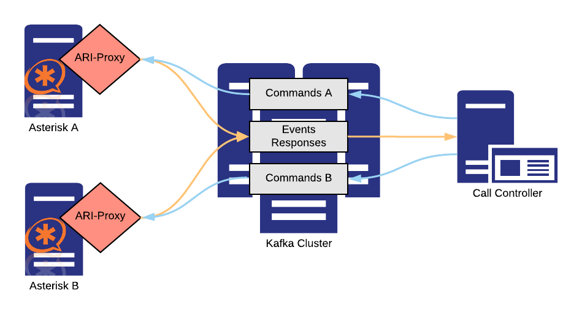

# ari-proxy
Ari-proxy connects [Asterisk](https://www.asterisk.org/), an open source communication server, to the [Apache Kafka](https://kafka.apache.org/intro) distributed streaming platform.

## Table of contents
1. [Abstract](#abstract)
2. [Getting started](#getting-started)
3. [Metrics](#metrics)
4. [Compatibility](#compatibility)
5. [Contributing & feedback](#contributing--feedback)
6. [Credit & License](#credit--license)
7. [Acknowledgements](#acknowledgements)

## Abstract
The motivation to create ari-proxy arose from the need to build distributed and resilient telephony services scaling up to millions of active users. Ari-proxy makes use of Kafka’s built-in routing concepts to ensure consistency of message streams and proper dispatching to the *call-controller*, the application implementing the service logic.



Please see [docs/concepts.md](/docs/concepts.md) for details on the concepts of message routing and session mapping.

## Getting started
In order to operate ari-proxy, make sure you have a running instance of both Asterisk and Kafka server.

#### Prerequisites
ari-proxy is written in Java, so you should [install and setup Java](https://www.java.com/en/download/help/download_options.xml) before continuing.
The project is managed by maven, which requires you to [install maven](https://maven.apache.org/install.html) as well.

#### Building
Build the fat jar in `target/`:
```bash
mvn package
```

#### Configuration
ari-proxy expects the following configuration files, which should be passed to the jvm when running the fat-jar:

| config               | optional | purpose                                                                                                                      |
| -------------------- | -------- | ---------------------------------------------------------------------------------------------------------------------------- |
| service.conf         | no       | configure the service, see our template: [service.conf.sample](service.conf.sample)                                          |
| log4j2.xml           | yes      | configure logging (if not specified, [a bundled config](/src/main/resources/log4j2.xml) will be used logging to STDOUT only) |
| jolokia.properties   | no       | configure jolokia agent properties, see our template: [jolokia.properties.sample](jolokia.properties.sample)                 |

#### Running
Run the fat jar:
```bash
java -Dconfig.file=/path/to/service.conf [-Dlog4j.configurationFile=/path/to/log4j2.xml] -jar target/ari-proxy-1.2.1-fat.jar
```

## Metrics
Ari-proxy provides service specific metrics using the [micrometer framework](http://micrometer.io) which are available via JMX.

| mbean                           | type    | description                                                                                  |
| ------------------------------- | --------| -------------------------------------------------------------------------------------------- |
| metrics:name=CallSetupDelay.\*  | Timer   | Measures the duration between a `StasisStart` event and the first response to an ari-command |
| metrics:name=CallsStarted       | Counter | Increases for every `StasisStart` event                                                      |
| metrics:name=CallsEnded         | Counter | Increases for every `StasisEnd` event                                                        |

Note: JMX data may be exposed via HTTP using the [jolokia jvm agent](http://jolokia.org) (see: [debian/ari-proxy@.service](/debian/ari-proxy.service)).

## Compatibility
We aim for compatibility with the latest stable release of
- [Java OpenJDK 8](http://openjdk.java.net/projects/jdk8)
- [Asterisk](https://wiki.asterisk.org/wiki/display/AST/Asterisk+Versions)
- the utilized [Akka Modules](https://akka.io/docs/)

## Contributing & feedback
To report a bug or make a request for new features, use the [Issues Page](https://github.com/retel-io/ari-proxy/issues) in the ari-proxy Github project.
We welcome any contributions. Please see the [Developer Guidelines](/CONTRIBUTING.md) for instructions on how to submit changes.

## Credit & License
ari-proxy is maintained by the folks at [sipgate](https://www.sipgate.de) and licensed under the terms of the [AGPL license](/LICENSE.txt).

Maintainers of this repository:

- Andreas [@hekmekk](https://github.com/hekmekk)
- Jonas [@boettner](https://github.com/boettner)
- Jöran [@vinzens](https://github.com/vinzens)
- Moritz [@m0](https://github.com/m0)
- Sebastian [@SipSeb](https://github.com/SipSeb)

Please refer to the Git commit log for a complete list of contributors.

## Acknowledgements
ari-proxy is not the first of its kind. This project was inspired by the concepts underlying both [go-ari-proxy by N-Visible](https://github.com/nvisibleinc/go-ari-proxy) as well as [ari-proxy by CyCore Systems](https://github.com/CyCoreSystems/ari-proxy).
